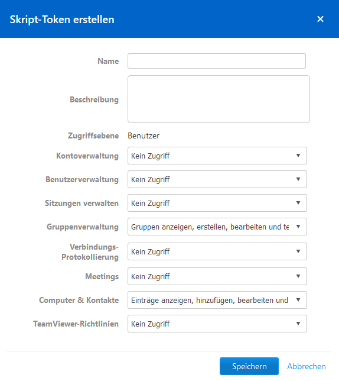

# team-viewer-manager

Console program to access the TeamViewer API and manage your devices, contacts and groups (export and import)

## Docu

[TeamViewer API Documentation](https://dl.tvcdn.de/integrate/TeamViewer_API_Documentation.pdf)

[Example of API usage](https://community.spiceworks.com/topic/2149517-is-it-possible-to-export-a-list-of-computers-from-teamviewer)

## HowTo use it

### Get TeamViewer authorization token

1. Login to [TeamViewer Management Console](https://login.teamviewer.com).
2. Click on your profile and select `Edit profile`.
3. Click on `Apps`.
4. Click on `Create script-token`.
5. Now you must at least select the following permissions:
   
6. Then give it a name and click on `Save`.
7. Now the token is displayed. Copy it.

### Download and extract the tool

1. Download the tool on the [release page](https://github.com/OidaTiftla/team-viewer-manager/releases).
2. Extract the `*.zip` file.

### Using the tool

1. Execute the `*.exe` file to start the tool.
2. Insert the copied token. (And type `y` or `n` whether you want to save that token for later use. If you want to transfer the devices from one account to another select `n`.)
3. Now choose what you want to do.

```
What do you want to do?
  1: export devices and groups (export.json)
  2: import devices and groups (import.json or export.json)
  3: delete all devices
  4: delete all contacts
  5: delete all groups (will also delete all devices and contacts)
  else: quit and exit the program
```

### Transfer computer list from one TeamViewer account to another

To do this you need two tokens. One for each account. (Remember which token belongs to which account, when creating them.)

1. Delete the file `authorization.token` next to the `*.exe` file of the tool (in the working directory of the tool).
2. Execute the `*.exe` file to start the tool and insert the token for the account from which you want to export the computer list.
3. For the question `Remember this authorization token?` enter `n`. (Because later we need to enter the token from the second account.)
4. For the question `What do you want to do?` enter `1`, to export all computers and contacts.
5. Now you can edit the file `export.json` and remove entries you do not want to import into the new account.
6. Then execute the `*.exe` file again and insert the token for the account to which you want to import the computer list.
7. For the question `Remember this authorization token?` enter `n`.
8. For the question `What do you want to do?` enter `2`, to import all computers. Contacts are currently not possible to import (because the TeamViewer API needs the email addresses to add them, but does not export them).
9. You are finished. Congratulations!
